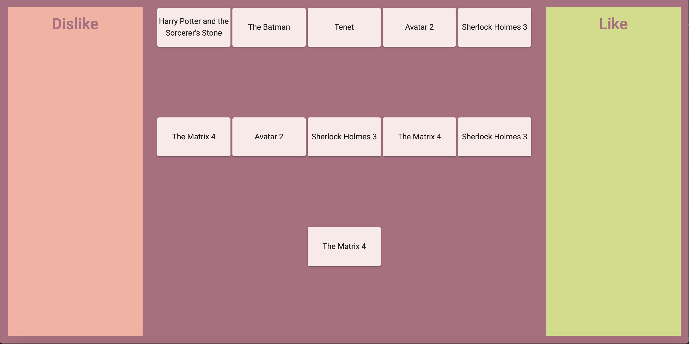

# DrugDrop

## Description
This application displays the work of Drug & Drop. For the backend, node js express 
server is written. Was created route “films” upon request for which you can get a list 
of films in json format. Data comes to the boxes in an http request from node js express 
server. The list of movies and Drug & Drop are implemented using Angular Material. To style 
the application, I used SCSS. The following libraries were used in the project: Angular 8.3.0, 
RxJS 6.4.0, Bootstrap 4.3.1, Angular Material 8.2.1, Express 4.16.1.
Images:

This project was generated with [Angular CLI](https://github.com/angular/angular-cli) version 8.3.0.

## Development server

Run `ng serve` for a dev server. Navigate to `http://localhost:4200/`. The app will automatically reload if you change any of the source files.

## Code scaffolding

Run `ng generate component component-name` to generate a new component. You can also use `ng generate directive|pipe|service|class|guard|interface|enum|module`.

## Build

Run `ng build` to build the project. The build artifacts will be stored in the `dist/` directory. Use the `--prod` flag for a production build.

## Running unit tests

Run `ng test` to execute the unit tests via [Karma](https://karma-runner.github.io).

## Running end-to-end tests

Run `ng e2e` to execute the end-to-end tests via [Protractor](http://www.protractortest.org/).

## Further help

To get more help on the Angular CLI use `ng help` or go check out the [Angular CLI README](https://github.com/angular/angular-cli/blob/master/README.md).
